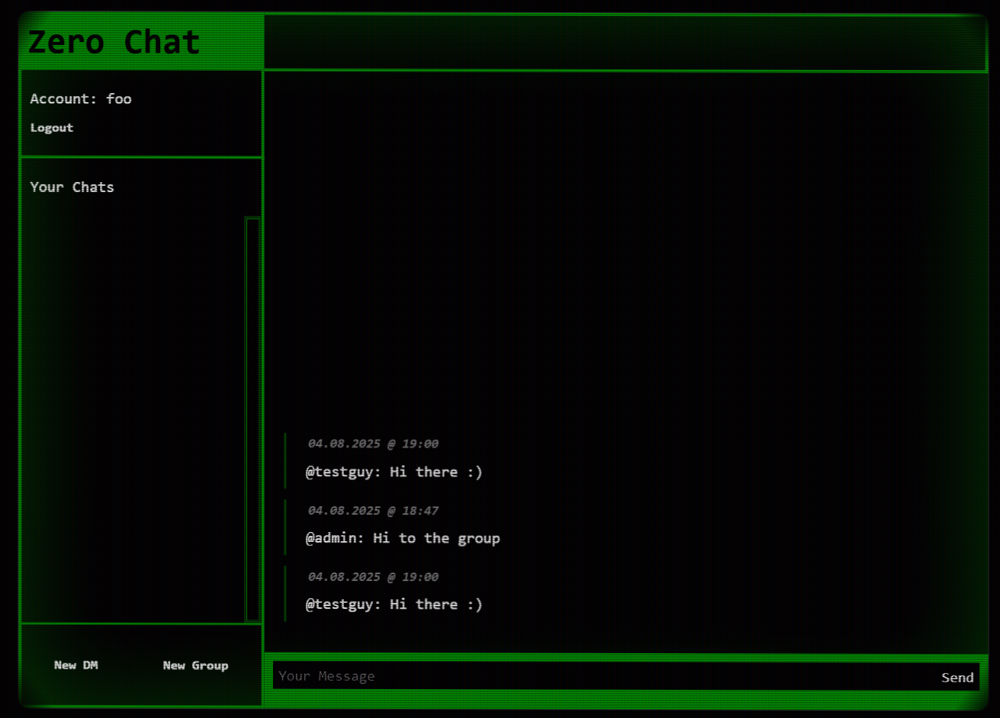
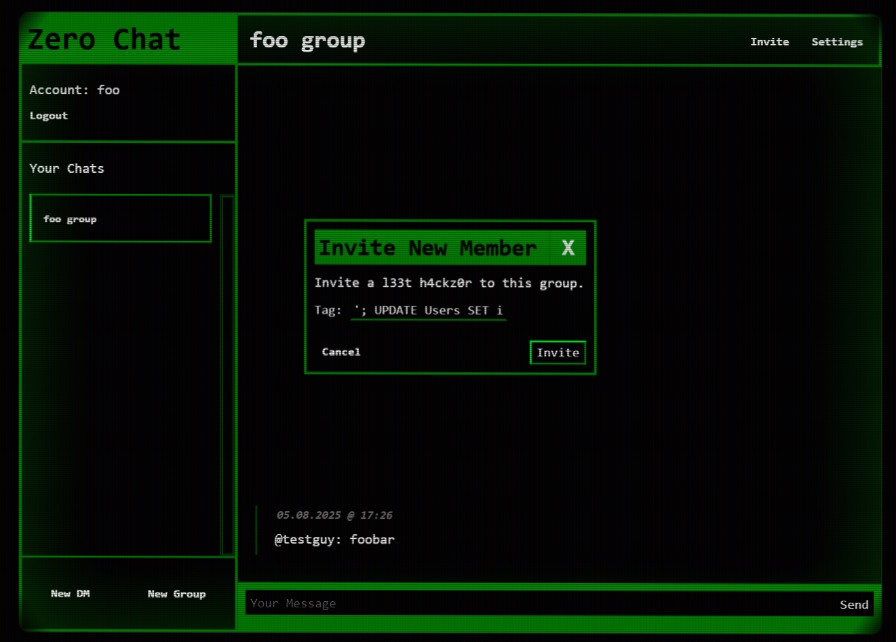
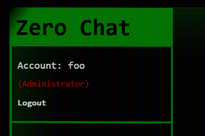
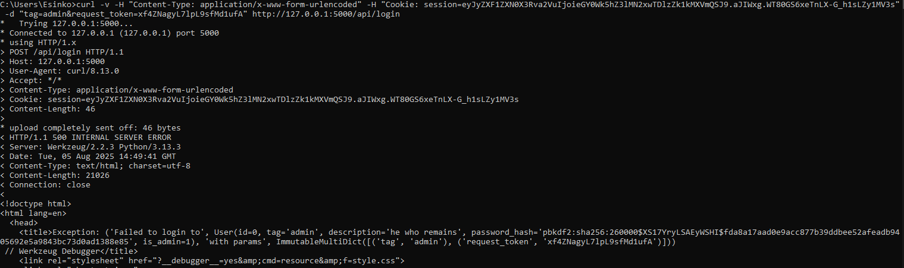
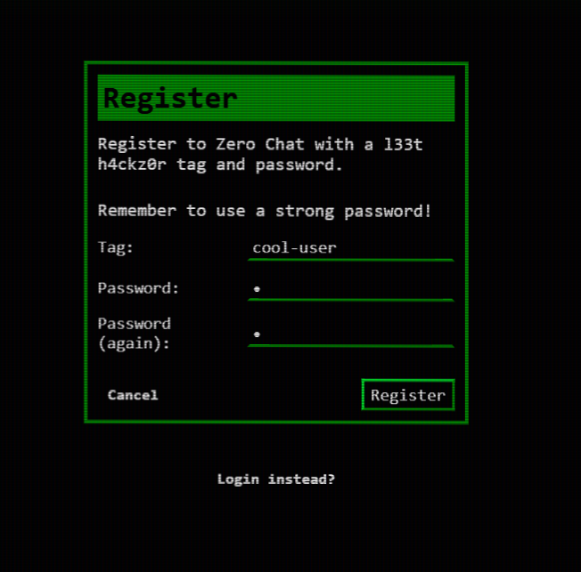
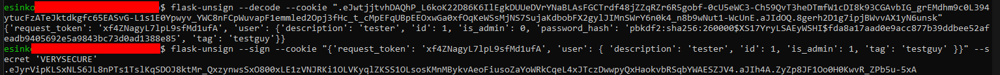
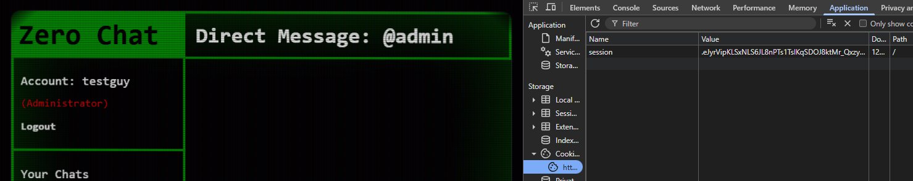

# Cyber Security Base (MOOC) Course Project 1
This is repository contains a full course project (1) for the Cyber Security Base course at the University of Helsinki.

The goal is to demonstrate 5 vulnerabilities from [OWASP's Top Ten](https://owasp.org/www-project-top-ten/) list (2021).
The presence of these vulnerabilities is clearly documented in the code with their proposed fixes commented out of the final program.

This repository also contains the project essay in its mandated form.

**Other Use Cases**
This repository is a nice sample project for creating [Capture The Flag (CTF)](https://en.wikipedia.org/wiki/Capture_the_flag_(cybersecurity)) challenges.

## About the Project

### Introduction: zero-chat
> *Chat about all of those zero-days you found. What's the risk?*

This project is a mockup of a for-hackers-by-hackers chat application do discuss the various Zero Day vulnerabilities they've discovered.

All chat-rooms are invite only, so you can easily keep your secrets to yourself...

Sign-up, create a profile for yourself and join chat-rooms or start a DM with another user.

### Architecture
The program has separate backend and frontend components. The frontend is made with Flask templates using only HTML and CSS. The backend is a Flask webserver programmed (natively) in Python `3.13`.

### Default Credentials
There are 2 default accounts:

1. `admin`

```
username: admin
password: 1234
type: admin
```

2. `testguy`

```
username: testguy
password: 1234
type: user
```


## Vulnerability Demonstrations
This project demonstrates 5 different types of vulnerabilities. If you want to discover them for yourself, get the project setup and skip the next section!

<details>
<summary>Reveal vulnerability list</summary>

### 1. `A01:2021 – Broken Access Control`
A variant of the *IDOR* (Insecure Direct Object References, [CWE-639](https://cwe.mitre.org/data/definitions/639.html)) vulnerability is present in the message polling API.

The API does not verify that the user is in the chat new messages are being attempted to be retrieved from.

This allows any authenticated user to fetch all messages or poll for new messages from any chat.

Perform the following request to request all the messages from any chat when logged in:



*User foo can see the chat with id '2' (created by another user) even when they are not in any chat.*

todo: add code block and link to code

### 2. `A03:2021 – Injection`
All chat-rooms are invite only, except if you are admin ;) The developers accidentally created a SQL injection in the Invite API ([CWE-89](https://cwe.mitre.org/data/definitions/89.html))

The `/api/invite` method handler is vulnerable to SQL injection via the `tag` parameter:



*You can open the dialog from the top right when in a group.* 

Full payload: `'; UPDATE Users SET is_admin = true WHERE tag = 'foo' --`

This makes the user `foo` an admin on the whole service.

When you log in again, your session has updated to admin:



todo: add code block and link to code

### 3. `A05:2021 – Security Misconfiguration`
A mistake in the final stages of development lead to the Flask debug mode being left on. Whoops!

This leads to the attacker being able to see full stacktraces when an error occurs. If a user tries to login without typing in a password, it will cause an error in the Login API.

You can trigger the error using `curl`:



*You can get the request_token and session cookie by simply loading the home page without logging in. The request_token is in the DOM in a hidden input field in various places and the session cookie in the cookie store (under Application tab in Chromium devtools)*

Unfortunately the stacktrace happens to contain the hashed password of the user :/ Luckily any sane developer implements password strength requirements :)

todo: add code block and link to code

### 4. `A07:2021 – Identification and Authentication Failures`
The Register API only requires the user to have *some* password. No strength check is present ([CWE-521](https://cwe.mitre.org/data/definitions/521.html))

You'll be able to register an account even with a password with the length of 1:



todo: add code block and link to code

### 5. `A02:2021 – Cryptographic Failures`
Whoops! The developers forgot to use a secure and sufficiently random secret for generating session IDs ([CWE-330](https://cwe.mitre.org/data/definitions/330.html))

This leads to an attacker being able to generate a session cookie for any account.

You can use a command-line tool called `flask-unsign`, which you can install with `pip`:



After setting our `session` cookie to the new cookie generated by `flask-unsign` we'll show up as admin:



*This also means the backend will treat the current session as an admin session. As all permission checks are based on the values stored in the session and not live database data!*

todo: add code block and link to code

</details>

## Installation Instructions

### Running From Source

#### Step 1a: Install Tooling
> You can skip this step if you want to handle the creation of a virtual environment manually. In that case, jump to step 1b.

This project used Python Dependency Manager (`pdm`) to handle dependencies and Python runtime requirements (eg. the virtual environment)

Before proceeding with installing `pdm`, make sure you have at least Python 3.9 installed in your system.

You can visit [pdm-project.org](https://pdm-project.org/en/latest/) for the most up to date install instructions or use any of these methods:

**With `pip` (Any OS)**
```sh
pip install --user pdm
```

**With `homebrew` (MacOS)**
```sh
brew install pdm
```

**With Powershell (Windows)**
```cmd
powershell -ExecutionPolicy ByPass -c "irm https://pdm-project.org/install-pdm.py | py -"
```

The installer will install PDM to the right place for your operating system:
- Unix: $HOME/.local/bin
- MacOS: $HOME/Library/Python/<version>/bin
- Windows: %APPDATA%\Python\Scripts

#### Step 1b: Create your virtual environment
Only do these steps if you skipped step 1! This approach is harder for inexperienced users and PDM is just really cool, so please use it :)

Make sure you have at least Python `3.9` available in your system. If not, please install Python `>=3.13`.

First create your virtual environment:
```
python3 -m venv venv
```

Then activate your virtual environment by executing the following based on your OS:
- Unix and MacOS: `source venv/bin/activate`
- Windows: `venv\Scripts\activate.bat`

#### Step 2: Install Dependencies
You can easily install all dependencies with `pdm`. If you are prompted to install a new version of Python, you can let it do that (handy right?)

```sh
pdm install
```

**Without `pdm`**
You can manually install dependencies via `pip` if you followed step 1b instead of 1a. Open `pyproject.toml` and install all dependencies from the `dependencies` list.

Install each dependency one-by-one with:

```sh
pip install package-name==version
```

*Replace `package-name` with the name of the package and `version` with the version of the package.*

#### Step 3: Run it!
The frontend and API will be available in port `5000`.

You can run the project with `pdm`:

```sh
pdm run start
```

**Without `pdm`:**
When the virtual environment and dependencies have been manually installed:

```sh
python3 src/main.py
```

### Running In Docker
Running CTF challenges in Docker containers is the way to go.

`Dockerfile` and `docker-compose.yaml` files are provided.

Sit back and relax with:

```sh
docker compose up
```

# License
Licensed under the MIT license. See `/License` file for specifics.
